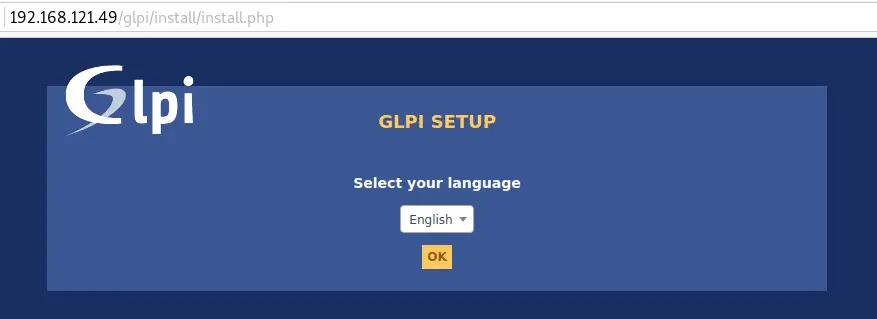

# How To Install GLPI on Ubuntu 22.04

GLPI is a powerful open source IT service management (ITSM) software tool designed to help you plan and easily manage your IT operations. GLPI allows you to solve problems more efficiently.
Its segmentation feature makes it easy to split entities based on their respective administrative policies and allowed expenditure. It has been argued that GLPI support management of large IT infrastructures with millions of assets.

## Features of GLPI

- Inventory Management – For computers, computers, peripherals, network printers e.t.c.
- Item lifecycle management
- Incidents, requests, problems and changes management
- Data Center Infrastructure Management (DCIM)
- Licenses management (ITIL compliant)
- Management of warranty and financial information (purchase order, warranty and extension, damping)
- Management of contracts, contacts, documents related to inventory items
- Knowledge base and Frequently-Asked Questions (FAQ)
- Asset reservation

All [features of GLPI](https://glpi-project.org) are available on the project website.

## Installing GLPI on Ubuntu 22.04

We will cover the steps of installing GLPI on Ubuntu LTS in the remaining sections. Before you can follow this guide along, you need to have a fresh installation of Ubuntu and user account with sudo privileges.

## Step 1: Update Ubuntu

As usual, ensure your packages list is up to date.

```

$ sudo apt update

```

You can also upgrade installed packages by running the following command.

```

$ sudo apt -y upgrade

```

## Step 2: Install MariaDB database server

GLPI requires a relational database to store its data. Let’s install MariaDB on Ubuntu Linux system by running the following commands:

```

$ sudo apt update
$ sudo apt install mariadb-server
$ sudo mysql_secure_installation

```

Create a database and user for GLPI.

```
$ sudo mysql -u root -p

CREATE DATABASE glpi;
CREATE USER 'glpi'@'localhost' IDENTIFIED BY 'StrongDBPassword';
GRANT ALL PRIVILEGES ON glpi.* TO 'glpi'@'localhost';
FLUSH PRIVILEGES;
EXIT;

```

## Step 3: Install PHP and Apache

We need to have Apache web server and PHP installed for GLPI to run and be accessed from a web interface.

```

$ sudo apt -y install php php-{curl,zip,bz2,gd,imagick,intl,apcu,memcache,imap,mysql,cas,ldap,tidy,pear,xmlrpc,pspell,mbstring,json,iconv,xml,gd,xsl}

```

Then install Apache and its PHP module.

```

$ sudo apt -y install apache2 libapache2-mod-php

```

Add the httpOnly flag to the cookie:

```

$ sudo vim /etc/php/*/apache2/php.ini
session.cookie_httponly = on

```

## Step 4: Download and Install GLPI

Download the latest stable release of GLPI. It follows a semantic versioning scheme, on 3 digits, where the first one is the **major release**, the second the **minor** and the third the **fix** release.

Check for the latest stable release on the [Downloads](https://glpi-project.org/downloads/) page. As of this wirting, this is 10.0.10.

```

$ sudo apt-get -y install wget curl
$ VER=$(curl -s https://api.github.com/repos/glpi-project/glpi/releases/latest|grep tag_name|cut -d '"' -f 4)
$ wget https://github.com/glpi-project/glpi/releases/download/$VER/glpi-$VER.tgz

```

Uncompress the downloaded the archive:

```

$ tar xvf glpi-$VER.tgz

```

Move the created **glpi** folder to the **/var/www/html** directory.

```

$ sudo mv glpi /var/www/html/

```

Give Apache user ownership of the directory:

```

$ sudo chown -R www-data:www-data /var/www/html/

```

## Step 5: Finish GLPI installation

Visit your server IP or hostname URL on **/glpi**. If it is your local machine, you can use: http://Server_IP/glpi

On the first page, Select your language.



Accept License terms and click **Continue**.


Choose **Install** for a completely new installation of GLPI.


Confirm that the Checks for the compatibility of your environment with the execution of GLPI is successful.


Configure Database connection


Select glpi database to initialize.


Finish the other setup steps to start using GLPI.


You should get the login page.


Default logins / passwords are:

- **glpi**/**glpi** for the administrator account
- **tech**/**tech** for the technician account
- **normal**/**normal** for the normal account
- **post-only**/**postonly** for the postonly account

On first login, you’re asked to change the password. Please set new password before configuring GLPI. This is done under **Administration > Users**.


This marks the end of installing GLPI on Ubuntu 22.04. The next sections are about adding assets and other IT Management stuff for your infrastructure/environment. For this, please refer to the [official GLPI documentation](https://glpi-project.org/resources/#documentation)
