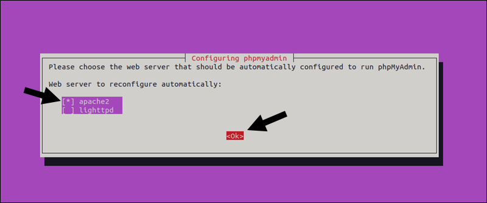
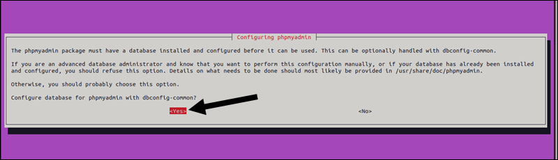
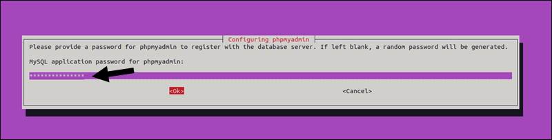
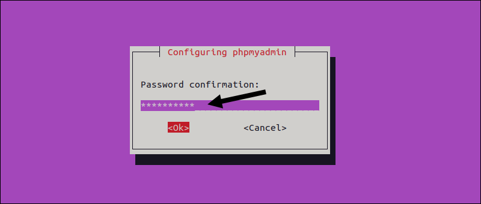
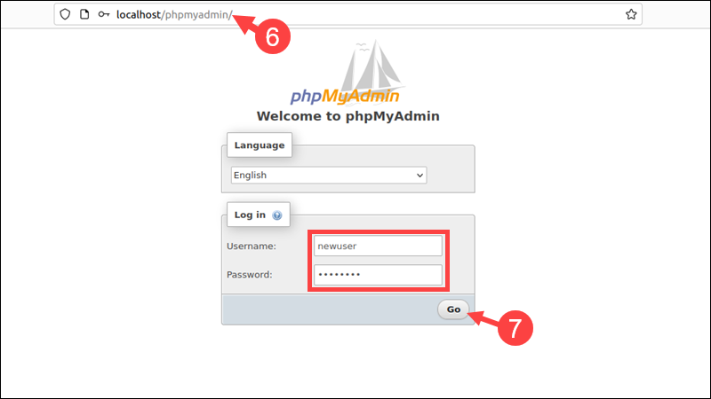
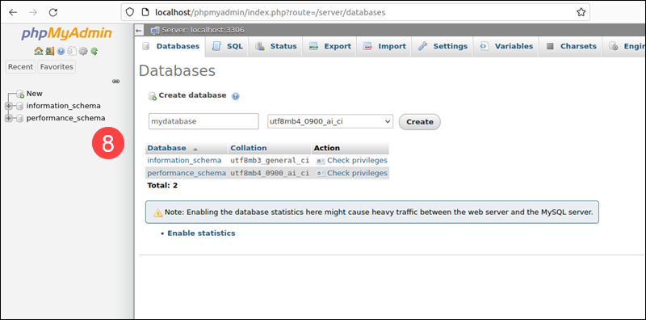

# How to Install phpMyAdmin on Ubuntu 22.04

## Introduction

phpMyAdmin is a free, open-source application for managing MySQL and MariaDB relational databases.

Beginners and experienced database administrators use phpMyAdmin to interact with MySQL databases via a web-based, user-friendly interface instead of manually entering commands into the terminal.

## Prerequisites

- Ubuntu 22.04 installed.
- A fully installed LAMP stack (Linux, Apache/Nginx, MySQL/MariaDB, PHP).
- A user account with root or sudo privileges.
- Access to a command line/terminal window.

!!! Note
    phpMyAdmin is a common target for cyberattacks, mainly due to misconfigurations or weak security settings. Connecting to a remote server and running phpMyAdmin over an unencrypted HTTP connection poses a security risk, as the data can be intercepted. For steps on setting up an encrypted connection using SSL/TLS certificates, please refer to our guide on SSL/TLS encryption.

# Installing phpMyAdmin on Ubuntu

This guide assumes that you are installing phpMyAdmin on a system that is not publicly accessible over the internet, often referred to as a local system. Follow the steps below to install phpMyAdmin on Ubuntu 20.04 or 22.04:

## Step 1: Update Your System

Access the command line and use the apt package manager to update the Ubuntu package repository and installed packages:

```

sudo apt update && sudo apt upgrade -y

```

Allow the operation to finish.

## Step 2: Install phpMyAdmin

Run the following command to install phpMyAdmin and its dependencies:

```

sudo apt install phpmyadmin -y

```

The installer prompts you to choose a web server to configure automatically. The **apache2** option is already highlighted if the system uses Apache. Press <kbd>Space</kbd> to select apache2, then <kbd>Tab</kbd> to highlight <kbd>Ok</kbd>.



Press <kbd>Enter</kbd> to confirm the selection.

(Optional) Select <kbd>Yes</kbd> and press <kbd>Enter</kbd> to set up a phpMyAdmin database using the *dbconfig-common* configuration package.



!!! Note 
    Advanced users can attempt to configure the database manually. Find more information about the *dbconfig-common* package on Debian's official website.

The installer creates a default user named phpmyadmin. Type a **strong password** for the *phpmyadmin* user and hit <kbd>Enter</kbd>.



!!! Note
    Leaving the password field blank causes the system to generate a random password.

Confirm the password and press <kbd>Enter</kbd>.



The default phpmyadmin user is typically used for managing the phpMyAdmin database, which stores metadata and settings for bookmarks, history, logs, and other advanced features. This user should not be used for general database management tasks because it is restricted to the phpMyAdmin database.

Database administrators typically use the MySQL root user or another user with appropriate permissions.

## Step 3: Create a New MySQL Administrator Account

phpMyAdmin provides a web interface to MySQL, including a root user with full administrative privileges.

Ubuntu 20.04 and 22.04 use the auth_socket plugin for root authentication. This authentication method does not allow password-based login for root users and disrupts the standard way phpMyAdmin is used to access MySQL.

Ubuntu users need to create a new MySQL user with administrative privileges or reconfigure the existing root user to enable password-based authentication.

To create a new phpMyAdmin user for accessing a MySQL database:

1.Open the MySQL terminal and log in as the sudo (or root) user:

```

sudo mysql

```

The terminal prompt shows that the MySQL shell is active.

2.Use the following command to create a new user with a secure password:

```

CREATE USER 'newuser'@'localhost' IDENTIFIED BY 'password';

```

Replace **[newuser]** with a username of your choice and **[password]** with a strong password.

3.Assign appropriate privileges to the new user. For example, to allow this user to perform all operations on a database called mydatabase, run:

```

GRANT ALL PRIVILEGES ON mydatabase.* TO 'newuser'@'localhost';

```

4.Flush all privileges:

```

FLUSH PRIVILEGES;

```

5.Exit the MySQL terminal:

```

EXIT;

```

6.Open a browser and access the phpMyAdmin login page by entering:

```

localhost/phpmyadmin

```

or

```

YOUR_IP/phpmyadmin

```

or

```

www.yourdomain.com/phpmyadmin

```

7.The browser displays a screen welcoming you to phpMyAdmin. Enter the newly created username and password and click <kbd>Go</kbd>.



8.The browser loads the phpMyAdmin dashboard.




